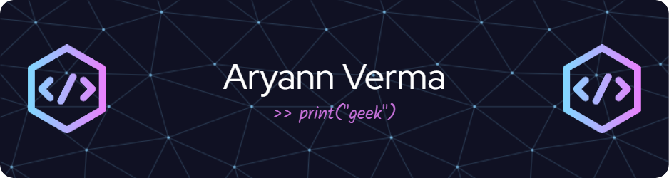

<h1 align="center">Hi 👋, I'm Aryann Verma</h1>
<h3 align="center">Still figuring out life...</h3>

- 📫 How to reach me **aryannverma1@gmail.com**

- ⚡ Fun fact **I can sing**

# 💻 Tech Stack:
                
# 📊 GitHub Stats:
 
 

---

<!-- Proudly created with GPRM ( https://gprm.itsvg.in ) -->
